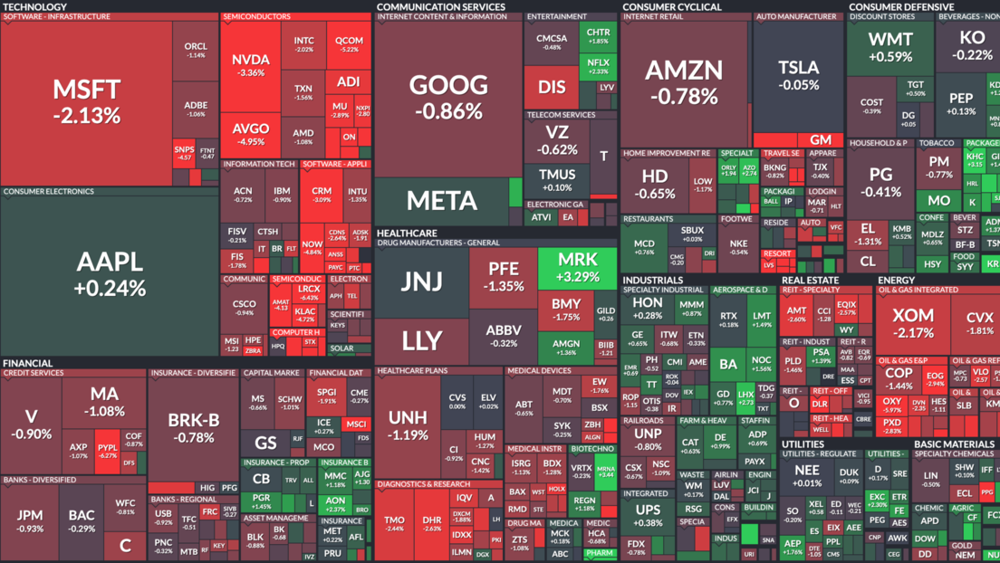

<h1 align="center">Análisis de inversión en mercado bursátil</h1>

## Introducción:
En este proyecto simulamos una situación en donde una empresa busca invertir en el mercado bursátil y nos solicita analizarlo en detalle. Como expertos en datos, estamos en capacidad de brindar una explicación de lo que ha sucedido en este mercado en los últimos años (considerando impactos positivos y negativos a partir del año 2000), recomendaciones de inversión y otra información complementaria. El foco del análisis es variado y amplio, pero nos limitamos a las empresas pertenecientes al índice SP500 (Standard & Poor's 500 Index).

## Desarrollo:
En primer lugar, realizamos un Análisis Exploratorio de los datos (EDA) con el fin de comprender mejor los datos y encontrar patrones, outliers y/o anomalías. El reporte se presenta en un notebook (.ipynb) con adecuado uso de markdowns y comentarios y contiene un resumen de estadísticas descriptivas de los datasets, análisis univariados y bivariados. Encontramos información relevante que nos ayudó a entender mejor el mercado bursátil en los últimos 23 años.

Posteriormente, creamos un Dashboard funcional usando streamlit y coherente con el análisis y la historia que queríamos relatar. El archivo está disponible en nuestro repositorio (.pbix) y contiene información relevante sobre las empresas pertenecientes al índice SP500. Incluimos gráficos interactivos que nos permiten ver la variación de precios en el tiempo, comparar entre distintas acciones, cálculo de estadísticas bursátiles y recomendaciones basadas en el retorno y riesgo de inversión.

Además, sugerimos 3 KPIs que aparecen en el Dashboard y están relacionados con la historia que estamos contando. Explicamos en la presentación el análisis y la funcionalidad de los KPIs sugeridos.

## Conclusiones:
En este proyecto, analizamos el mercado bursátil en los últimos 23 años a partir del índice SP500. Realizamos un Análisis Exploratorio de los datos, creamos un Dashboard funcional y sugerimos 3 KPIs que nos permiten entender mejor la situación del mercado y generar recomendaciones de inversión. No solamente producimos gráficos con datos, sino también analizamos y llegamos a conclusiones relevantes para la empresa. Todo el proyecto se encuentra disponible en nuestro repositorio de GitHub, incluyendo un Readme principal donde se presenta de forma general nuestro proyecto.